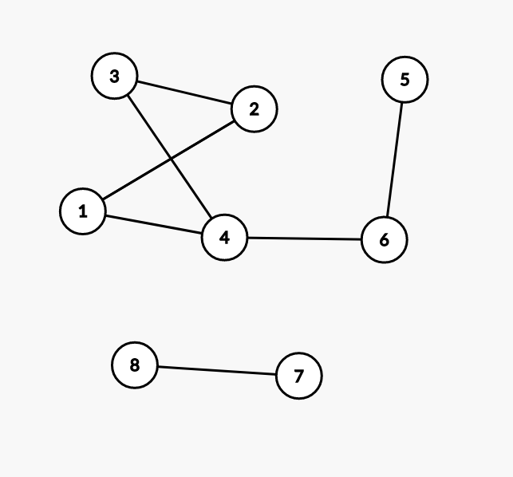

# Обходи графів. Обхід в глибину, #

## Представлення графів

Зазвичай графом називається будь-яка структура, де є одна категорія - вершини, і друга - ребри. Кожне ребро сполучає дві вершини між собою. 

Зазвичай ми будемо нумерувати вершини числами від 1 до n, а ребра - числами від 1 до m. 

Наприклад в наступному графі 



Вершини пронумеровані від 1 до 8, а ребра поєднують такі пари вершин:
- (1, 2)
- (1, 4)
- (2, 3)
- (3, 4)
- (4, 5)
- (5, 6)
- (7, 8)

Зверніть увагу, що ребра в цьому графі неорієнтовані - тобто можна записати ребра як 
- (2, 1)
- (4, 1)
- (2, 3)
- (4, 3)
- (4, 5)
- (6, 5)
- (7, 8)

і граф не змінится.

Всього можна представляти графи в пам'яті декількома способами. розглянемо найпоширеніші. 

### Матриця суміжності

Для цього використовується матриця $a$ розміром $n$ x $n$, в якій в клітинці $a_{i,j}$ стоїть 1, якщо вершини $i$ та $j$ поєднані ребром і 0 інакше. Для графа вище матриця матиме наступний вигляд:

```
[
    [0, 1, 0, 1, 0, 0, 0, 0],
    [1, 0, 1, 0, 0, 0, 0, 0],
    [0, 1, 0, 1, 0, 0, 0, 0],
    [1, 0, 1, 0, 0, 1, 0, 0],
    [0, 0, 0, 0, 0, 1, 0, 0],
    [0, 0, 0, 1, 1, 0, 0, 0],
    [0, 0, 0, 0, 0, 0, 0, 1],
    [0, 0, 0, 0, 0, 0, 0, 1]
]
```

Як ми бачимо, матриця симетрична відносно основної діагоналі, оскільки граф неорієнтований - якщо між $i,j$ є ребро, то також ребро є і між $j,i$.

Код для зчитування графа цим методом наступний:

```
const int N = 1000; // max number of vertixes in graph
int a[N + 1][N + 1];
int n, m; 
cin >> n >> m;
for (int i = 0; i < m; i++) {
    int x, y; cin >> x >> y;
    a[x][y] = 1;
    a[y][x] = 1;
}
```

В цього методу представлення є як і плюси - очевидність заповнення, інтуїтивність, так і глобальний мінус. На нашому прикладі видно, що більшість матриці заповнена нулями, а отже ми використовуємо завжди $n^2$ пам'яті, щоб зберегти рівно $m$ даних. Цю проблему вирішує наступний метод


### Список суміжності 

Список суміжності будується так. Давайте зберігати для вершини $i$ список всіх вершин, до яких з неї є ребро. На прикладі вище вийде наступні списки:

```
[
    [2, 4], // for 1
    [3, 4], // for 2
    [2, 4], // for 3
    [1, 3, 6], // for 4
    [6], // for 5
    [4, 5], // for 6
    [8], // for 7
    [7] // for 8
]
```

Як бачимо, ми використали набагато менше місця, зберігши повну структуру графа в зручному способі. Зазвичай використовують саме цей метод зберігання графа. 

Код для зчитування графа цим методом наступний:

```
const int N = 1000; // max number of vertixes in graph
vector<int> g[N + 1]
int n, m; 
cin >> n >> m;
for (int i = 0; i < m; i++) {
    int x, y; cin >> x >> y;
    g[x].push_back(y);
    g[y].push_back(x);
}
```

Як бачимо, складність коду не зимінилася, але ми використовуємо $n+m$ пам'яті замість $n^2$. 

* Завдання на подумати - чому не $m$, а $n+m$. 

## Зберігання в одному масиві*

Розділ підвищеної складності. Ми можемо зберігати граф рівно двома масивами. Подумайте як. 

Підказка - один з масивів буде зберігати всі ребра в зв'язному списку. А що буде зберігати інший?


## Обхід в глибину

Зберігати графи це круто, але що можна з ними робити?

Найпростіше завдання в графі - знайти кількість компонентів зв'язності. 

Компонента зв'язності однієї вершини - це найбільша множина вершин, таких що існує шлях від будь-якої вершини з множини до будь-якої іншої. 

Наприклад, в графі вище ми маємо дві компоненти зв'язності - компоненту $(1, 2, 3, 4, 5, 6)$ і компоненту $(7, 8)$. 

Для знаходження кількості компонент в графі використовуються методи "обходу" графів. Перший з них - метод обходу в глибину. 

Ідея в наступному. 
1) Почнемо з будь-якої вершини (наприклад вершини 1). Додамо її в множину відвіданих вершин. Нам потрібно знайти всі вершини, до яких з неї можна дістатися. Куди точно можна дістатися? До вершин, в які є ребро. 
2) Пройдемося по всіх ребрах з поточної вершини (вони в нас зручно зберігаються у списку суміжності). Знайдемо будь-яку вершину, в якій ми ще не були і перейдемо в неї. 
3) Позначимо її, як відвідану і перейдемо до кроку 2. 
4) Якщо не знайшли жодноїх вершини повернемося до тої, з якої прийшли і продовжимо пошук. 


Пройдемося на прикладі вище.
|номер дії|дія|множина відвіданих|
|-|-|-|
|1|Стартуємо з вершини 1. Ребра ведуть в вершини (2, 4).|{1}|
|2|Ми не були в жодній, перейдемо в вершину 2. |{1, 2}|
|3|Ребра [3, 4] - перейдемо в вершину 3|{1,2}|
|4| Додаємо в список. Дивимся на ребра - ребра [2, 4] - перейдемо в вершину 4, в вершині 2 вже були | {1,2,3}
|5| Додаємо в список. Дивимся на ребра - ребра [1, 3, 6] - перейдемо в вершину 6, в інших вже були | {1,2,3,4}
|6| Додаємо в список. Дивимся на ребра - ребра  [4, 5] - перейдемо в вершину 5, в інших вже були | {1,2,3,4,6}
|7| Додаємо в список. Дивимся на ребра - ребра  [6]. Нема що додавати - завершуємо пошук | {1,2,3,4,5,6}
|8| Перейшли назад до вершини 6. Серед ребер нема невідвіданих. | {1,2,3,4,5,6}
|8| Перейшли назад до вершини 4. Серед ребер нема невідвіданих. | {1,2,3,4,5,6}
|8| Перейшли назад до вершини 3. Серед ребер нема невідвіданих. | {1,2,3,4,5,6}
|8| Перейшли назад до вершини 2. Серед ребер нема невідвіданих. | {1,2,3,4,5,6}
|8| Перейшли назад до вершини 1. Серед ребер нема невідвіданих. | {1,2,3,4,5,6}
|8| Кінець алгоритму. | {1,2,3,4,5,6}

Таким чином ми знайшли компоненту зв'язності для вершини 1 - множину {1,2,3,4,5,6}. Помітимо, що ця ж компонента актуальна для всіх вершин з неї. Щоб знайти всі компоненти ми маємо вибрати будь-яку ще не відвідану вершину і почати пошук з неї. 

Щодо реалізації. Для зберігання множиин відвіданих вершин нам знадобится ще один масив - `used`. `used[v] = 1`, якщо ми вже відвідали вершину `v` і 0 інакше. 

Код:

```
const int N = 1000; // максимальна кількість вершин в графі.
vector<int> g[N + 1]; // граф у вигляді списку суміжності.
bool used[N+1]; // множина вершин.

void dfs(int v) {
    used[v] = 1; // відвідаємо поточну вершину
    for (int u: g[v]) { // проходимся по всіх ребрах, шукаючи вершину, в якій ще не були. 
        if (!used[u]) { // якщо не були в вершині
            dfs(u); // шукаємо з неї.
        }
    }
}

// Читаємо граф та викликаємо dfs(1);
```

Як ми бачимо, механізм рекурсії самостійне поверне нас в вершину, з якої ми прийшли, якщо ми не зможемо знайти перехід з поточної вершини!

## Додаткові ресурси 
- https://uk.wikipedia.org/wiki/%D0%9F%D0%BE%D1%88%D1%83%D0%BA_%D1%83_%D0%B3%D0%BB%D0%B8%D0%B1%D0%B8%D0%BD%D1%83
- https://cp-algorithms.com/graph/depth-first-search.html
- https://ru.algorithmica.org/cs/graph-traversals/storing-graphs/
- https://ru.algorithmica.org/cs/graph-traversals/dfs/


